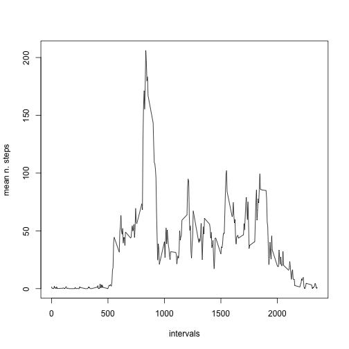
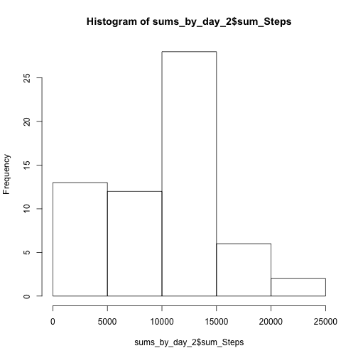
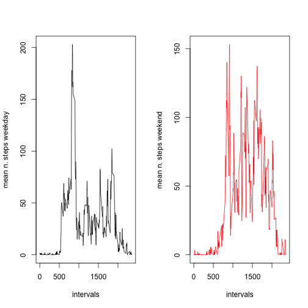

Reproducible Research Exam - Peer Assesment n.1

###STEP 1 - Loading and preprocessing the data  
  
Loading Libraries

```r
library(plyr)
library(dplyr)
```

  
Loading and Analyzing data

```r
db<-read.csv("activity.csv")

head(db)
```

```
##   steps       date interval
## 1    NA 2012-10-01        0
## 2    NA 2012-10-01        5
## 3    NA 2012-10-01       10
## 4    NA 2012-10-01       15
## 5    NA 2012-10-01       20
## 6    NA 2012-10-01       25
```

```r
str(db)
```

```
## 'data.frame':	17568 obs. of  3 variables:
##  $ steps   : int  NA NA NA NA NA NA NA NA NA NA ...
##  $ date    : Factor w/ 61 levels "2012-10-01","2012-10-02",..: 1 1 1 1 1 1 1 1 1 1 ...
##  $ interval: int  0 5 10 15 20 25 30 35 40 45 ...
```

```r
summary(db)
```

```
##      steps                date          interval     
##  Min.   :  0.00   2012-10-01:  288   Min.   :   0.0  
##  1st Qu.:  0.00   2012-10-02:  288   1st Qu.: 588.8  
##  Median :  0.00   2012-10-03:  288   Median :1177.5  
##  Mean   : 37.38   2012-10-04:  288   Mean   :1177.5  
##  3rd Qu.: 12.00   2012-10-05:  288   3rd Qu.:1766.2  
##  Max.   :806.00   2012-10-06:  288   Max.   :2355.0  
##  NA's   :2304     (Other)   :15840
```


###STEP 2 - What is mean total number of steps taken per day?


1. Calculate the total number of steps taken per day


```r
db_mean_day<-group_by(db,date)
sums_by_day<-summarize(db_mean_day,sum(steps,na.rm=TRUE))
colnames(sums_by_day)[2]<-"sum_Steps"
head(sums_by_day)
```

```
## Source: local data frame [6 x 2]
## 
##         date sum_Steps
## 1 2012-10-01         0
## 2 2012-10-02       126
## 3 2012-10-03     11352
## 4 2012-10-04     12116
## 5 2012-10-05     13294
## 6 2012-10-06     15420
```

2. If you do not understand the difference between a histogram and a barplot, research the difference between them. Make a histogram of the total number of steps taken each day


```r
hist(sums_by_day$sum_Steps)
```

 


3. Calculate and report the mean and median of the total number of steps taken per day


```r
means_by_day<-summarize(db_mean_day,mean(steps,na.rm=TRUE))
colnames(means_by_day)[2]<-"mean_Steps"
means_by_day$mean_Steps[is.nan(means_by_day$mean_Steps)]<-0
head(means_by_day)
```

```
## Source: local data frame [6 x 2]
## 
##         date mean_Steps
## 1 2012-10-01    0.00000
## 2 2012-10-02    0.43750
## 3 2012-10-03   39.41667
## 4 2012-10-04   42.06944
## 5 2012-10-05   46.15972
## 6 2012-10-06   53.54167
```

```r
median_by_day<-summarize(db_mean_day,median(steps,na.rm=TRUE))
colnames(median_by_day)[2]<-"median_Steps"
median_by_day$median_Steps[is.nan(median_by_day$median_Steps)]<-0
head(median_by_day)
```

```
## Source: local data frame [6 x 2]
## 
##         date median_Steps
## 1 2012-10-01           NA
## 2 2012-10-02            0
## 3 2012-10-03            0
## 4 2012-10-04            0
## 5 2012-10-05            0
## 6 2012-10-06            0
```


###STEP 3 -What is the average daily activity pattern?

1. Make a time series plot (i.e. type = "l") of the 5-minute interval (x-axis) and the average number of steps taken, averaged across all days (y-axis)


```r
db_mean_interval<-group_by(db,interval)
means_by_interval<-summarize(db_mean_interval,mean(steps,na.rm=TRUE))
colnames(means_by_interval)[2]<-"mean_Steps"
plot(means_by_interval$interval, means_by_interval$mean_Steps, type = "l", col = "black", ylab = "mean n. steps", xlab = "intervals")
```

 

2. Which 5-minute interval, on average across all the days in the dataset, contains the maximum number of steps?


```r
max_interval<-subset(means_by_interval,means_by_interval$mean_Steps==max(means_by_interval$mean_Steps))
max_interval
```

```
## Source: local data frame [1 x 2]
## 
##   interval mean_Steps
## 1      835   206.1698
```


###STEP 4 - Imputing missing values

1. Calculate and report the total number of missing values in the dataset (i.e. the total number of rows with NAs)


```r
any(is.na(db))
```

```
## [1] TRUE
```

```r
db_na_logic=is.na(db)
nrow(subset(db,db_na_logic))
```

```
## [1] 2304
```

2. Devise a strategy for filling in all of the missing values in the dataset. The strategy does not need to be sophisticated. For example, you could use the mean/median for that day, or the mean for that 5-minute interval, etc.

3. Create a new dataset that is equal to the original dataset but with the missing data filled in.

```r
db_with_mean<-join(db,means_by_day,type="left")
```

```
## Joining by: date
```

```r
for(i in 1:nrow(db_with_mean)){
  if (is.na(db_with_mean[i,1])) {
    db_with_mean[i,1]<- db_with_mean[i,4]
  } else {    
  }}

db_with_mean<-db_with_mean[,c(1,2,3)]
head(db_with_mean)
```

```
##   steps       date interval
## 1     0 2012-10-01        0
## 2     0 2012-10-01        5
## 3     0 2012-10-01       10
## 4     0 2012-10-01       15
## 5     0 2012-10-01       20
## 6     0 2012-10-01       25
```


4. Make a histogram of the total number of steps taken each day and Calculate and report the mean and median total number of steps taken per day. 


```r
db_mean_day_2<-group_by(db_with_mean,date)
sums_by_day_2<-summarize(db_mean_day_2,sum(steps,na.rm=TRUE))
colnames(sums_by_day_2)[2]<-"sum_Steps"
hist(sums_by_day_2$sum_Steps)
```

 

```r
means_by_day_2<-summarize(db_mean_day_2,mean(steps,na.rm=TRUE))
colnames(means_by_day_2)[2]<-"mean_Steps"
means_by_day_2$mean_Steps[is.nan(means_by_day_2$mean_Steps)]<-0
head(means_by_day_2)
```

```
## Source: local data frame [6 x 2]
## 
##         date mean_Steps
## 1 2012-10-01    0.00000
## 2 2012-10-02    0.43750
## 3 2012-10-03   39.41667
## 4 2012-10-04   42.06944
## 5 2012-10-05   46.15972
## 6 2012-10-06   53.54167
```

```r
median_by_day_2<-summarize(db_mean_day_2,median(steps,na.rm=TRUE))
colnames(median_by_day_2)[2]<-"median_Steps"
head(median_by_day_2) 
```

```
## Source: local data frame [6 x 2]
## 
##         date median_Steps
## 1 2012-10-01            0
## 2 2012-10-02            0
## 3 2012-10-03            0
## 4 2012-10-04            0
## 5 2012-10-05            0
## 6 2012-10-06            0
```

Do these values differ from the estimates from the first part of the assignment? 
*NO that much, most NA values are in days without steps*

What is the impact of imputing missing data on the estimates of the total daily number of steps?
*Ther eis a very low impact, most replacement are 0s instead of NA*


###STEP 5 - Are there differences in activity patterns between weekdays and weekends?

1. Create a new factor variable in the dataset with two levels – “weekday” and “weekend” indicating whether a given date is a weekday or weekend day. --> *Sorry, weekdays are in Italian :)*


```r
db_with_mean$day<-weekdays(as.Date(db_with_mean$date))

for(i in 1:nrow(db_with_mean)){
  if (db_with_mean[i,4]=='Sabato' || db_with_mean[i,4]=='Domenica') {
    db_with_mean[i,4]="weekend"
  } else { 
    db_with_mean[i,4]="weekday"
  }}

head(db_with_mean)
```

```
##   steps       date interval     day
## 1     0 2012-10-01        0 weekday
## 2     0 2012-10-01        5 weekday
## 3     0 2012-10-01       10 weekday
## 4     0 2012-10-01       15 weekday
## 5     0 2012-10-01       20 weekday
## 6     0 2012-10-01       25 weekday
```

2. Make a panel plot containing a time series plot (i.e. type = "l") of the 5-minute interval (x-axis) and the average number of steps taken, averaged across all weekday days or weekend days (y-axis). 


```r
db_with_mean_weekday<-subset(db_with_mean,day=="weekday")
db_with_mean_weekend<-subset(db_with_mean,day=="weekend")

db_mean_interval_weekday<-group_by(db_with_mean_weekday,interval)
means_by_interval_weekday<-summarize(db_mean_interval_weekday,mean(steps,na.rm=TRUE))
colnames(means_by_interval_weekday)[2]<-"mean_Steps"

db_mean_interval_weekend<-group_by(db_with_mean_weekend,interval)
means_by_interval_weekend<-summarize(db_mean_interval_weekend,mean(steps,na.rm=TRUE))
colnames(means_by_interval_weekend)[2]<-"mean_Steps"


par(mfrow=c(1,2))
plot(means_by_interval_weekday$interval, means_by_interval_weekday$mean_Steps, type = "l", col = "black", ylab = "mean n. steps weekday", xlab = "intervals")
plot(means_by_interval_weekend$interval, means_by_interval_weekend$mean_Steps, type = "l", col = "red", ylab = "mean n. steps weekend", xlab = "intervals")
```

 
